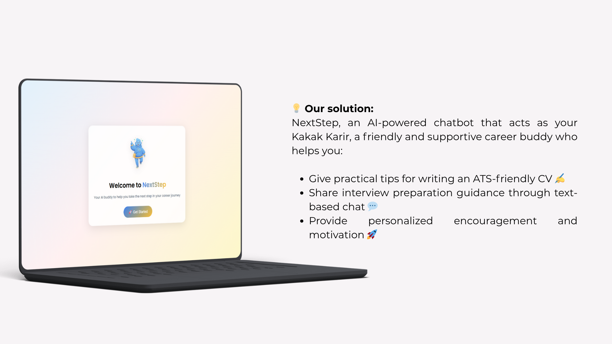
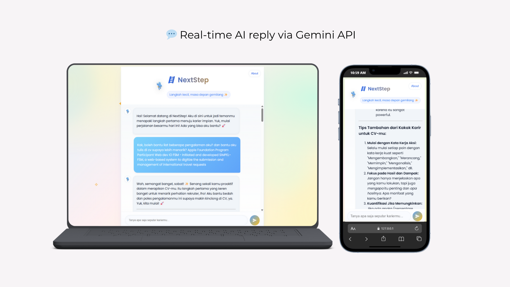

# 🪜 NextStep – AI Career Assistant  
_Final Project — Hacktiv8 Maju Bareng AI IT Developer Program_

> “Big journeys start small — take your next step.” ✨
---

## 🌟 Overview

**NextStep** is an AI-powered career assistant that acts as your **Kakak Karir** —  
a friendly and supportive chatbot designed to help fresh graduates build confidence and prepare for their professional journey.

💬 The chatbot provides:  
- 💡 Career tips and insights for young professionals  
- 🗣️ Guidance to improve self-presentation and confidence  
- 🌱 Encouragement to grow and take small steps forward 

🧠 Powered by **Gemini 2.5 Flash**, built with **Express.js** and **Vanilla JavaScript**,  
and designed with a clean, responsive UI inspired by pastel tones and minimalism.

---

## 🚀 Live Demo

🖥️ **Preview the chatbot here:**  
👉 [https://muthiazs.github.io/NextStepBot/](https://muthiazs.github.io/NextStepBot/)

---

## 🧩 Features

| Feature | Description |
|----------|-------------|
| 💬 Chat Interface | Responsive and friendly text-based chat UI |
| 🧠 Gemini API Integration | Real-time AI response via Google Gemini (local mode) |
| 🎨 Pastel Themed Design | Soothing UI for better user experience |
| 🧭 Persona Design | AI acts as *Kakak Karir* — warm, encouraging, and helpful |

---

## 🧠 Tech Stack

| Layer | Tools / Framework |
|-------|--------------------|
| **AI Model** | Google Gemini 2.5 Flash |
| **Backend** | Node.js (Express.js) |
| **Frontend** | Vanilla JS + Web Components |
| **Styling** | CSS Grid + Gradient UI |
| **Version Control** | Git & GitHub |

---

## 💬 Chatbot Persona: "Kakak Karir"

> Kamu adalah *Kakak Karir*, seorang mentor AI yang ramah, suportif, dan antusias.  
> Gaya bahasamu semi-formal, positif, dan mudah dimengerti.  
> Gunakan emoji ✨🚀👍 secara wajar untuk memberi semangat.  
> Akhiri setiap jawaban dengan dorongan positif agar pengguna merasa percaya diri. 💪

---

